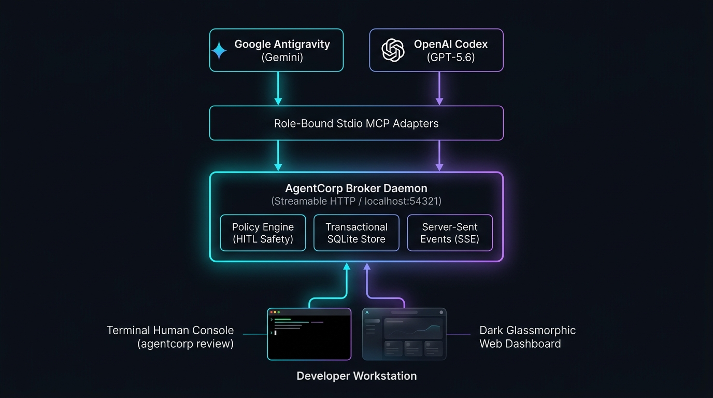

# AgentCorp

AgentCorp is a local-first coordination broker for teams of AI agents. It gives
MCP-capable agents stable roles, typed messages, durable tasks, approval gates,
and access-controlled artifacts without coupling the agents to one vendor or
model.

> Status: **developer preview (v0.2 — Milestone 2 Seamless Human Console Complete)**.
> Central long-lived broker daemon, terminal-native human console & review loop,
> real-time SSE event pipeline, dark glassmorphic web dashboard, and audit exports are ready.



## What works today

- Long-lived broker daemon over MCP Streamable HTTP, Admin REST API, and Server-Sent Events (`/api/events`)
- Terminal-native human console (`agentcorp console`) and interactive review loop (`agentcorp review`)
- Sleek dark glassmorphic web dashboard with live push updates and side-by-side JSON diff editor
- Thin role-bound stdio adapters proxying to the central daemon
- Role definitions and allowed communication paths loaded from `org.toml`
- Per-role and admin credentials stored securely in `.agentcorp/credentials.json`
- Role-bound MCP connections with connection-enforced caller identity
- Typed messages with durable status history
- Safe-by-default approval policy evaluation
- Human approve, edit-and-approve, and reject commands with full audit logging
- Validated task lifecycle transitions
- SHA-256-addressed artifact metadata with role-scoped read checks
- Transactional SQLite persistence with versioned schema migrations
- Automated human-readable Markdown and JSON audit trail exports (`coord/`)
- Public TypeScript API plus the `agentcorp` CLI

## Requirements

- Node.js 22.13 or newer

AgentCorp uses Node's built-in `node:sqlite` module to avoid native npm
dependencies. On Node 22 it may print an experimental-feature warning; it does
not require an experimental flag from 22.13 onward.

## Quick start

Until the first npm release, run the CLI from this repository:

```sh
npm install
npm run build
node dist/cli.js init
node dist/cli.js validate
node dist/cli.js start
```

After publication:

```sh
npm install --global agentcorp-broker
agentcorp init
agentcorp validate
agentcorp start
```

`agentcorp init` creates an architect/developer organization with conservative
approval defaults and generates local credentials under `.agentcorp/credentials.json`.
Runtime state under `.agentcorp/` should not be committed.

## Connect agents over MCP

Each local MCP connection is bound to exactly one configured role. Use absolute
paths for `--config` and `--db` when your MCP host does not preserve the project
working directory.

```json
{
  "mcpServers": {
    "agentcorp-architect": {
      "command": "agentcorp",
      "args": [
        "--config", "/absolute/project/org.toml",
        "--db", "/absolute/project/.agentcorp/agentcorp.db",
        "mcp", "--role", "architect"
      ]
    }
  }
}
```

Configure the second agent with the same config and database paths, changing
only the final role to `developer`.

The MCP tool surface includes:

- `register_role`, `whoami`
- `create_task`, `list_tasks`, `update_task_status`
- `send_message`, `get_inbox`, `acknowledge_message`, `get_thread`
- `create_artifact`, `list_artifacts`, `get_artifact`

## Human approval console

AgentCorp offers first-class human-in-the-loop oversight designed for terminal-first developer workflows with an optional live web dashboard.

### 1. Terminal-Native Interaction (Preferred)

Launch the status summary or dive straight into interactive sign-off:

```sh
# View daemon status, task counts, and pending approvals
agentcorp console

# Interactive sign-off loop ([a]pprove, [e]dit & approve, [r]eject, [s]kip, [q]uit)
agentcorp review
```

### 2. Live Web Dashboard

Open the modern dark glassmorphic dashboard with live push updates over Server-Sent Events (`/api/events`):

```sh
agentcorp console --browser
```

Features include:
- Real-time approval feed with side-by-side JSON diff editor
- Role inboxes & active task threads
- Artifact catalog viewer
- Runtime policy inspector and instant toggle switch (enable / disable)

### 3. Direct Scriptable CLI Commands

Messages and transitions that do not match an `auto_approve` rule are held by default.

```sh
agentcorp approvals list
agentcorp approvals approve <approval-id> --note "Reviewed"
agentcorp approvals approve <approval-id> --payload '{"revised":"payload"}'
agentcorp approvals reject <approval-id> --note "Needs a safer plan"
agentcorp policies list
agentcorp policies set '{"id":"safe-reports","subject":"message","priority":80,"message_type":"report","risk_tags":["read_only"],"action":"auto_approve"}'
agentcorp policies disable safe-reports
```

The recipient cannot see a pending message. Approval changes its state to
`delivered`; rejection keeps it out of the inbox.

## Policy semantics

Policies are initially seeded from `org.toml` into SQLite. After the first run,
the database is the source of truth. Rules are evaluated by descending
`priority`; every populated condition on a rule must match. Risk tags use
subset matching: all tags named by the rule must be present on the request.

If no rule matches, AgentCorp requires human approval. The reserved
`delegate_to_role` action is rejected in v0 rather than silently weakened.

## Development

```sh
npm run check
npm test
npm run build
npm pack --dry-run
```

The main design document is [AgentCorp_Design_Spec.md](./AgentCorp_Design_Spec.md).
The delivery sequence and design gaps are tracked in
[docs/ROADMAP.md](./docs/ROADMAP.md).

## Security model

AgentCorp v0.1 enforces identity, routing, policy, and artifact checks inside
its MCP/CLI boundary. It does not sandbox an underlying agent's general shell
or filesystem access. Keep the SQLite file and administrative CLI unavailable
to untrusted processes. A separate authenticated broker daemon is planned for
v0.2 to create a stronger process boundary.

See [SECURITY.md](./SECURITY.md) for reporting and deployment guidance.

## License

Apache-2.0. See [LICENSE](./LICENSE).
