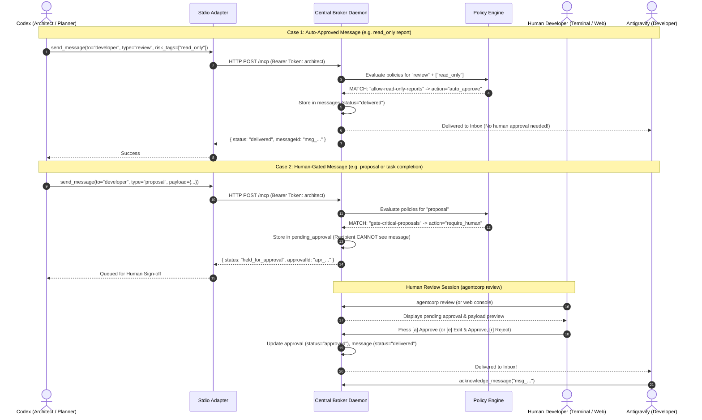
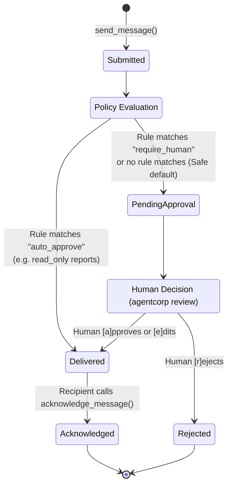
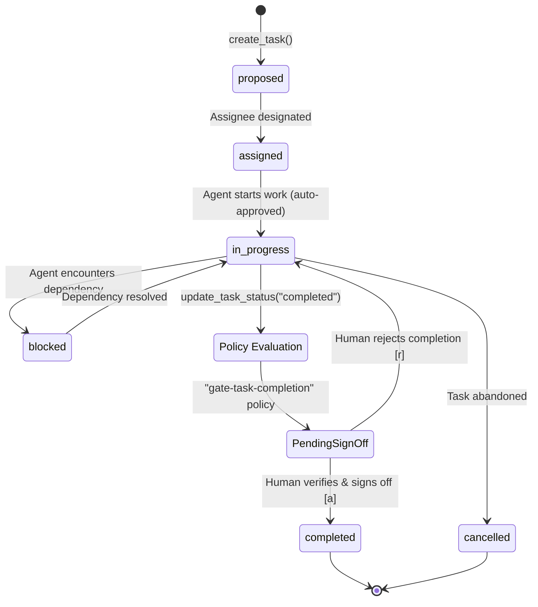

# Human Oversight Console Guide

AgentCorp provides first-class Human-in-the-Loop (HITL) oversight designed for developer speed. You can review and approve agent actions directly inside your terminal or through a real-time web dashboard.

---

## 1. How It Works: Sequence & State Diagrams

### A. Inter-Agent Coordination Sequence Diagram

This diagram shows how messages move between agents, how policies are evaluated, and when human oversight is triggered:



---

### B. Lifecycle State Diagrams

#### Message Lifecycle State Machine



#### Task Lifecycle State Machine



---

## 2. Terminal-Native Interaction (Preferred)

Terminal-native interaction provides instantaneous, zero-latency review without context switching into a browser.

### A. Dashboard Overview (`agentcorp console`)
Run the console command to view system status, task counts, and pending approvals:

```sh
agentcorp console
```

Output:
```text
┌─────────────────────────────────────────────────────────────┐
│  AGENTCORP  ::  Human Approval & Coordination Console       │
└─────────────────────────────────────────────────────────────┘

 Status Summary:
   Pending Approvals: 1
   Total Tasks:       3
   Daemon URL:        http://127.0.0.1:54321
   Web Dashboard:     http://127.0.0.1:54321/console

 Pending Approvals Queue:
   • apr_b12480ad-191a-45c1-92ee-48c68832a820 (message) by architect [2026-09-05T00:30:12.000Z]

 Review pending approvals now? [Y/n]
```

If pending items exist, pressing <kbd>Enter</kbd> or <kbd>Y</kbd> immediately launches the interactive review session.

---

### B. Interactive Review Loop (`agentcorp review`)
Run `agentcorp review` (or `agentcorp approvals review`) to step through pending requests one by one:

```sh
agentcorp review
```

For each item, you see:
- Approval ID and subject (`[MESSAGE]` or `[TASK TRANSITION]`).
- Requesting agent role and target recipient.
- Formatted context and JSON payload.

#### Keyboard Actions:
| Key | Action | Description |
|---|---|---|
| <kbd>a</kbd> | **Approve** | Signs off immediately. Prompts for an optional reviewer note. |
| <kbd>e</kbd> | **Edit & Approve** | Prompts for a revised JSON payload. Validates syntax in real time and delivers the modified message to the recipient. |
| <kbd>r</kbd> | **Reject** | Rejects the request. Prompts for feedback/reason that will be recorded in the audit trail. |
| <kbd>s</kbd> | **Skip** | Skips the current item without making a decision. |
| <kbd>q</kbd> | **Quit** | Exits the review session cleanly. |

---

## 2. Real-Time Web Dashboard (`agentcorp console --browser`)

If you prefer a visual interface, launch the dark glassmorphic web dashboard:

```sh
agentcorp console --browser
```

### Dashboard Features:
1. **Live SSE Indicator**: Pulsing connection badge powered by Server-Sent Events (`/api/events`). No polling required.
2. **Approvals Feed**: Real-time sign-off feed with one-click **Approve**, **Reject**, or **Edit & Approve** with a side-by-side JSON diff editor.
3. **Role Inboxes**: Inspect messages delivered to each agent's inbox, track read receipts, and view full threads.
4. **Tasks Kanban**: Live tracking across `open`, `in_progress`, `blocked`, and `completed` states.
5. **Artifacts Catalog**: Inspect SHA-256 addressed artifacts, metadata, and visibility boundaries.
6. **Policy Manager**: View all runtime policies and toggle them on/off with instant switches.
